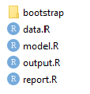

# Creating a TAF analysis

The first step in creating a TAF analysis is to set out the basic folder and file structure of the project.
This is done using the function [`taf.skeleton`](https://rdrr.io/cran/icesTAF/man/taf.skeleton.html)
which creates the following structure in your working directory

