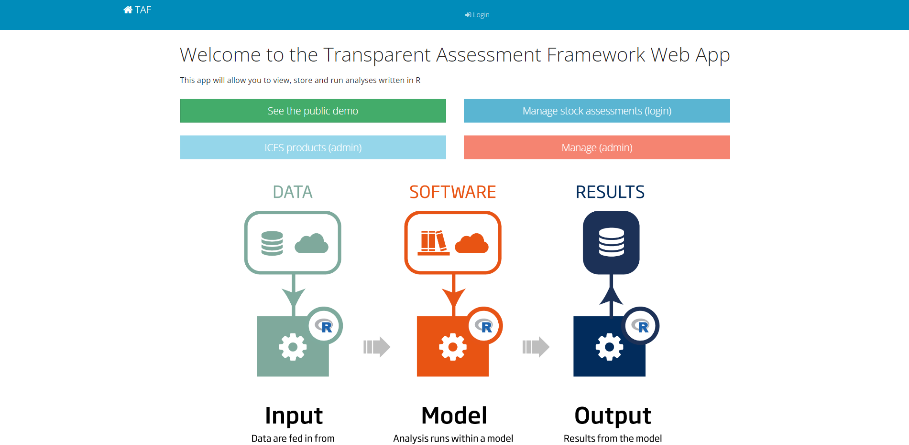
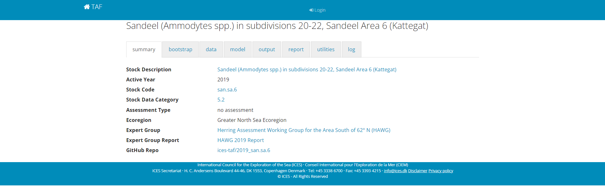

```{r setup, echo=FALSE, message=FALSE, warning=FALSE}
source("R/utilities.R")
```

See also:
[Creating a TAF analysis](Creating-a-TAF-analysis).

This page was based on using the `icesTAF` package version ```r packageVersion("icesTAF")```
dated ```r packageDate("icesTAF")```.

## In this guide

* [Finding a TAF analysis](#finding-a-taf-analysis)


## Finding an analysis

The first step is finding a TAF analysis that you want to run.  All TAF stock assessments
are made available on the [TAF web application](https://taf.ices.dk/app/about) 
(see screenshot below). There are publicly avilable analyses and private ones.  Private 
analyses have not yet been made publicly available and require to be reviewed. Public 
analyses are accessed by clicking the "see publlic demo" button, and private analyses are 
accessed by clicking the "Manage stock assessments" button - this is only available to 
logged in users of the ICES network and specifically to members of ICES stock assessment 
working groups.

[](https://taf.ices.dk/app/about)

In the following example we will select the 2019 sandeel in area 6 assessment, and the 
application gives a link to the github repository for the code as `ices-taf/2019_san.sa.6`. 
as seen below:

[](https://taf.ices.dk/app/demo#!/2019/san.sa.6)


## Getting the code

